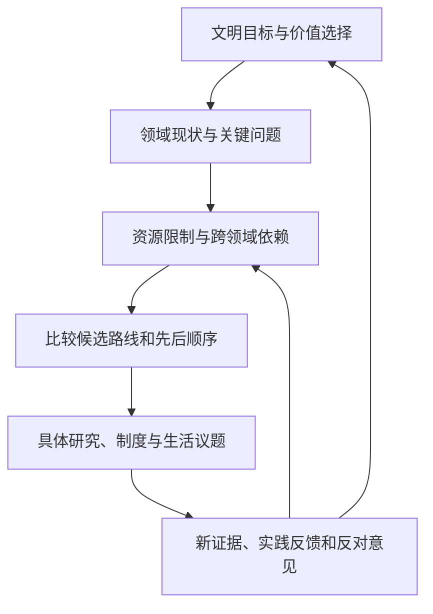

# 开放未来文明蓝图 · Open Future Blueprint

**一起讨论：有限资源下，人类文明应该先发展什么、如何协调各领域，以及何时改变路线。**

这是一个公开的讨论书与蓝图计划。内容包括科学、技术、生产、资源、生活、文化、制度与长期未来。项目以文档和讨论为主体，不需要程序代码。

## 先看明确的初始方案

### [文明统筹初始方案 v0.3](plans/civilization-roadmap-v0.3.md)

在发起者委托下，AI 从文明统筹视角提出第一版路线：

**先保障基本生活与关键系统运行，同时持续积累科学与教育能力；优先打通可靠知识到实际生产和公共服务的路径，保留长期探索与调整空间。**

全文包含五个阶段、十个领域的第一轮安排、科学研究的选择方式、虚构的增量预算起点、调整规则和前十二个月的讨论工作单。

这是一个明确、可以反驳的起点，尚未经社区共同认可，也不是已经计算出的最优解。时间和预算均标明假设；项目不拥有实际治理权或资源调度权。

[进入讨论区](https://github.com/RRXXZZYY/open-future-blueprint/discussions) · [提出想法或反对意见](https://github.com/RRXXZZYY/open-future-blueprint/issues/new/choose) · [参与指南](CONTRIBUTING.md)

## 文明的十个领域

| 领域 | 分区示例 |
| --- | --- |
| 基础科学与认识世界 | 数学、物理、化学、生命科学、地球与复杂系统 |
| 技术与工程能力 | AI、计算、材料、制造、机器人、实验与验证 |
| 能源、资源与生态 | 能源、水、食物、材料循环、生态保护与修复 |
| 生产、经济与劳动 | 产业、供应链、劳动转型、交换与分配 |
| 生活、健康与照护 | 居住、健康、照护、家庭、社区与日常服务 |
| 教育、文化与人的发展 | 学习、人才、艺术、知识传播、价值与意义 |
| 制度、治理与公共协作 | 参与、权利责任、资源规则与跨区域合作 |
| 城市、基础设施与连接 | 交通、物流、水电通信、公共空间 |
| 安全、韧性与和平 | 灾害准备、可靠性、冲突预防与恢复 |
| 太空与文明长期未来 | 空间探索、长期生存与代际责任 |

查看[完整分类与归档方式](domains/README.md)。领域排序不是资源优先级；一个议题可以关联多个领域。

## 怎样从全局走到具体

均衡发展不等于平均分配。每一条优先级建议都应说明：为什么现在做、帮助什么、需要什么、推迟了什么，以及什么变化会让判断失效。

## 阅读导航

| 内容 | 入口 |
| --- | --- |
| 希望走向怎样的文明 | [愿景与共同问题](docs/vision.md) |
| 怎样处理资源与优先级 | [跨领域统筹方法](framework/coordination.md) |
| 领域之间如何相互支撑和竞争 | [依赖与反馈](framework/dependencies.md) |
| 不同资源路线如何比较 | [纸面示例](scenarios/resource-allocation.md) |
| 科学内部如何讨论突破方向 | [基础科学分区](domains/foundational-science/README.md) |
| 日常灵感放在哪里 | [生活领域](domains/life-and-wellbeing/README.md) |
| 项目怎样逐步积累文档 | [文档建设路线](ROADMAP.md) |
| 意见不一致怎么办 | [协作治理](GOVERNANCE.md) |
| 怎样判断事实和 AI 科研消息 | [证据记录](docs/evidence.md) |

房屋空间、儿童活动和夜市地图是生活领域的首批灵感，不定义项目的顶层范围，也不自动取得全局优先权。

## 谁可以参与

欢迎研究者、从业者、学生、居民、设计者和任何关心未来的人。可以贡献一个观察、一条反对意见、一篇研究来源、一幅草图或完整路线。

不会写代码也能参与：在讨论区写普通文字，由维护者协助整理正文并保留署名。可以提出与初始方案不同的目标和路线；没有回应不等于达成共识。

## 版本与许可

当前：**v0.3 · 首次公开讨论版**。新增内容随提交更新，可在[修订记录](https://github.com/RRXXZZYY/open-future-blueprint/commits/main/)查看变化。

原创文档与设计采用 **CC BY-SA 4.0**，允许在遵守署名、标明修改和相同方式共享等条件下传播与改编，包括商业使用。[完整许可](LICENSE) · [署名与内容来源](ATTRIBUTION.md)。

首版由发起者提出方向和生活灵感，AI 辅助结构设计、资料整理与统筹方案写作。分类、预算、顺序和判断均可被质疑；没有已成立的专家委员会或现实实施承诺。
