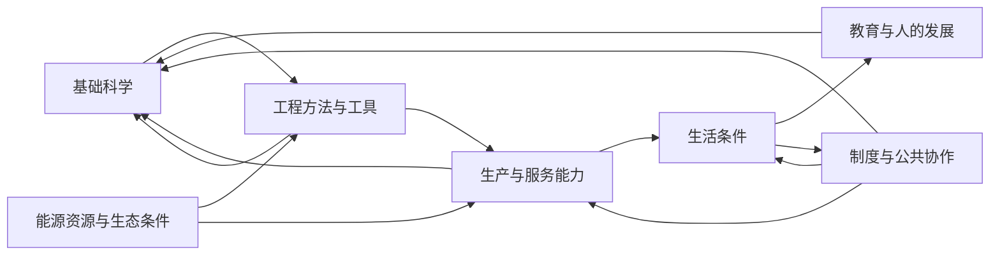

# 文明发展的依赖、反馈与竞争

状态：概念示例；箭头不代表已验证的因果强度、充分条件或必经顺序。

## 依赖图需要超越单向“科技树”

图中也存在成本、竞争与负面反馈。例如科研与工业可能争用电力和人才；生产活动可能增加生态负担；推广过快可能超过教育、维护和组织能力。这些内容需要以具体关系记录，不能只画促进发展的箭头。

## 关系记录格式

来源议题 → 目标议题 / 关系类型 / 为什么有关 / 必要还是有帮助 / 替代路径 / 发生时间 / 证据与不确定性 / 额外成本 / 复查条件。

关系类型包括：前提、促进、替代、竞争、负面影响、反馈。

## 概念示例：计算能力扩张

| 关系 | 要核实什么 | 路线含义 |
| --- | --- | --- |
| 算法改进 → 更少计算需求 | 实际任务效果、适用范围和验证成本 | 有时可以减少硬件扩张需求，但不能提前假定 |
| 电力与设施 → 可运行计算能力 | 可用容量、连接条件、可靠性与建设周期 | 有设备也可能因配套不足无法投入使用 |
| 研究成果 → 工程部署 | 可复现性、稳定性、实际流程是否适配 | 证明或演示之后仍有工程工作 |
| 工程部署 → 实际生产收益 | 使用意愿、培训、成本和维护条件 | 能部署不等于形成普遍收益 |
| 技能与组织学习 → 有效使用 | 学习时间、岗位变化和负责人 | 可以与技术研发同步推进 |
| 计算扩张 ↔ 其他公共需求 | 电力、人才与预算是否冲突 | 同时比较替代方式和被挤占事项 |

这些是待核查的问题，不是某地区当前存在上述瓶颈的事实陈述。

## 怎样连接科学与应用

为每个重大科学方向记录潜在影响链，但允许纯知识探索保留独立价值。为每个应用方向追溯它真正缺少的条件，也要允许“已有知识足够，主要困难在组织、设施或成本”的结论。

避免重复统计：同一项培训、能源设施或工具建设可以支持多个领域，但其成本在总账里只记录一次；贡献的收益也需说明是否重叠。

## 怎样记录时间

区分研究结果的不确定时间、工程建设周期、人员培养周期、投入后的收益延迟和维护期限。不用一张没有时间信息的图直接决定资金与任务顺序。
